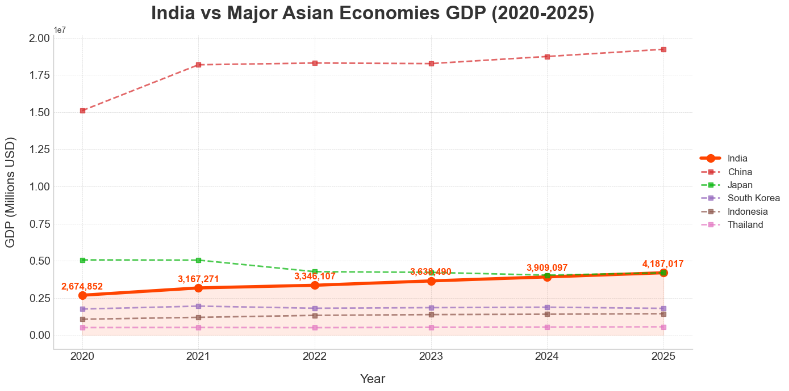
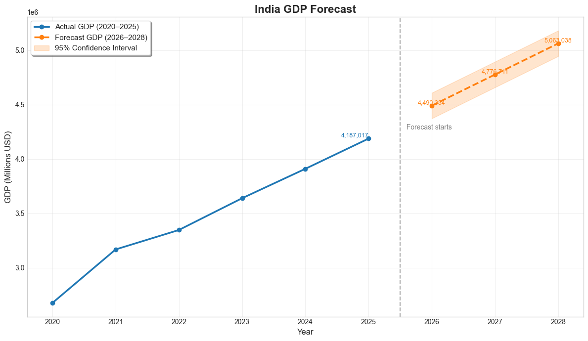
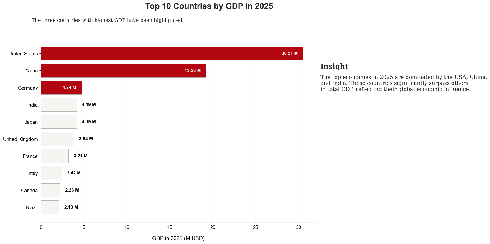
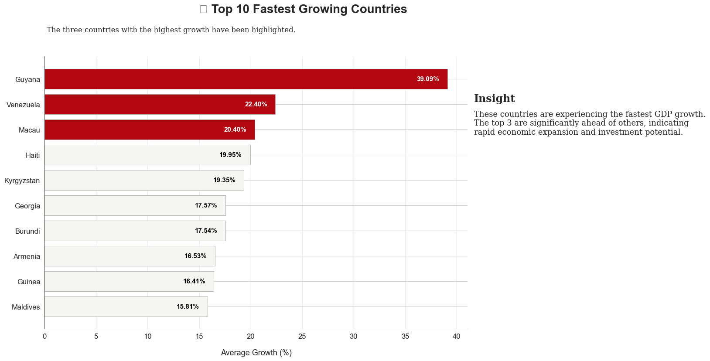

# 🌍 Global GDP Analysis (2020–2025) – Exploratory Data Analysis (EDA)

 


 


---

## 📌 Project Overview
This project provides a **comprehensive analysis of global GDP trends from 2020 to 2025**, with a focus on **India and major Asian economies**.  

It uncovers insights on **country-wise GDP growth, CAGR comparisons, and regional economic trends** through **Exploratory Data Analysis (EDA)** and **professional visualizations**.  

🖼️ **Visualizations:** All plots and charts are stored in the `visuals/` folder.  
## 📊 Visualizations Summary

### 1️⃣ India vs Asian Economies (2020–25)  
  

### 2️⃣ India GDP Forecast  
  

### 3️⃣ Top 10 GDP Countries in 2025  
  

### 4️⃣ Top Fastest Growing Countries  
 
---

## 📂 Dataset
The dataset is stored in the `data/` folder:

- `data/GDP_2020-2025.csv` – Contains GDP values for 196 countries from 2020 to 2025  

> **Note:** Place this CSV file in the `data/` folder to run the notebook correctly.

---

## 🎯 Problem Statement
Perform a **detailed GDP analysis** by answering key economic questions:

- Country-wise GDP growth trends (2020–2025)  
- India’s GDP vs other Asian economies  
- Top 10 countries by **CAGR (Compound Annual Growth Rate)**  
- GDP snapshot comparison for 2025  
- Regional patterns and emerging economies  

---

## 🔎 Analysis & Visualizations
Key insights and trends include:

- 📈 India’s CAGR (2020–2025) surpasses Japan and other peers  
- 🇨🇳 China remains the largest economy but with slower CAGR  
- 🇮🇩 Indonesia and Vietnam emerge as fast-growing Asian economies  
- 📊 Visualizations include **line plots, bar charts, and comparative growth analysis**  
- ⚡ All plots are saved in the `visuals/` folder for reference  

---

## 📁 Project Structure
The repository is organized as follows:
global-gdp-analysis-2020-2025/
│
├── data/
│ └── GDP_2020-2025.csv
│
├── visuals/
│ ├── india_vs_asia_trend.png
│ ├── top10_cagr.png
│ └── gdp_comparison.png
│
├── notebooks/
│ └── gdp_analysis.ipynb # Main Jupyter notebook
|
├── LICENSE # MIT License
|
├── README.md # Project documentation
|
└── SUMMARY.md # Key insights and visualizations

---

## 📌 How to Use
1. **Clone the repository:**
```bash
git clone https://github.com/YOUR-USERNAME/global-gdp-analysis-2020-2025.git
cd global-gdp-analysis-2020-2025
